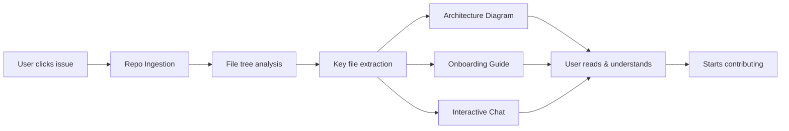
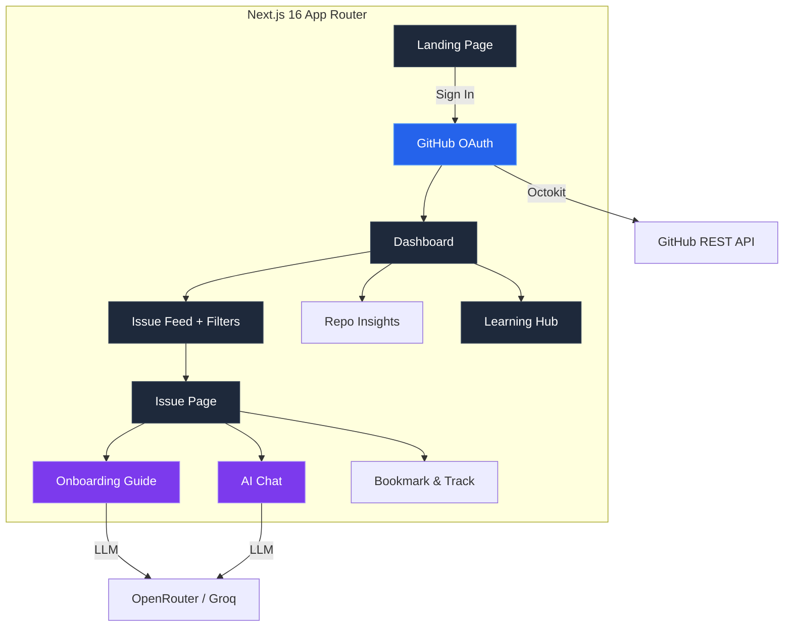

<div align="center">
  <svg width="100%" height="auto" viewBox="0 0 1200 400" fill="none" xmlns="http://www.w3.org/2000/svg" style="max-width: 1000px; border-radius: 16px;">
    <defs>
      <linearGradient id="bg" x1="0" y1="0" x2="1" y2="1">
        <stop offset="0%" stop-color="#0f172a" />
        <stop offset="50%" stop-color="#1e1b4b" />
        <stop offset="100%" stop-color="#172554" />
      </linearGradient>
      <linearGradient id="glow1" x1="0" y1="0" x2="1" y2="1">
        <stop offset="0%" stop-color="#6366f1" stop-opacity="0.3" />
        <stop offset="100%" stop-color="#6366f1" stop-opacity="0" />
      </linearGradient>
      <linearGradient id="glow2" x1="1" y1="0" x2="0" y2="1">
        <stop offset="0%" stop-color="#3b82f6" stop-opacity="0.2" />
        <stop offset="100%" stop-color="#3b82f6" stop-opacity="0" />
      </linearGradient>
      <linearGradient id="pill" x1="0" y1="0" x2="1" y2="1">
        <stop offset="0%" stop-color="rgba(255,255,255,0.12)" />
        <stop offset="100%" stop-color="rgba(255,255,255,0.05)" />
      </linearGradient>
      <linearGradient id="pill-border" x1="0" y1="0" x2="1" y2="1">
        <stop offset="0%" stop-color="rgba(255,255,255,0.2)" />
        <stop offset="100%" stop-color="rgba(255,255,255,0.05)" />
      </linearGradient>
      <pattern id="grid" x="0" y="0" width="40" height="40" patternUnits="userSpaceOnUse">
        <path d="M40 0H0V40" stroke="rgba(255,255,255,0.03)" stroke-width="0.5" />
      </pattern>
      <filter id="glow">
        <feGaussianBlur stdDeviation="60" result="blur" />
        <feMerge><feMergeNode in="blur" /><feMergeNode in="SourceGraphic" /></feMerge>
      </filter>
    </defs>

    <!-- Background -->
    <rect width="1200" height="400" rx="16" fill="url(#bg)" />
    <rect width="1200" height="400" rx="16" fill="url(#grid)" />

    <!-- Glow orbs -->
    <circle cx="200" cy="350" r="200" fill="url(#glow1)" filter="url(#glow)" />
    <circle cx="1000" cy="100" r="180" fill="url(#glow2)" filter="url(#glow)" />

    <!-- Border -->
    <rect width="1200" height="400" rx="16" stroke="rgba(255,255,255,0.06)" stroke-width="1" fill="none" />

    <!-- RS Logo pill -->
    <rect x="560" y="100" width="80" height="40" rx="20" fill="url(#pill)" stroke="url(#pill-border)" stroke-width="0.5" />
    <text x="600" y="127" text-anchor="middle" fill="rgba(255,255,255,0.9)" font-family="system-ui, -apple-system, sans-serif" font-size="18" font-weight="700" letter-spacing="1">RS</text>

    <!-- Title -->
    <text x="600" y="180" text-anchor="middle" fill="white" font-family="system-ui, -apple-system, sans-serif" font-size="52" font-weight="700" letter-spacing="-1">RepoSage</text>

    <!-- Tagline -->
    <text x="600" y="225" text-anchor="middle" fill="rgba(255,255,255,0.6)" font-family="system-ui, -apple-system, sans-serif" font-size="18" font-weight="400" letter-spacing="0.3">Your first open source contribution, guided end to end.</text>

    <!-- Feature pills -->
    <rect x="340" y="265" width="150" height="32" rx="16" fill="rgba(99,102,241,0.15)" stroke="rgba(99,102,241,0.3)" stroke-width="0.5" />
    <text x="415" y="286" text-anchor="middle" fill="rgba(99,102,241,0.9)" font-family="system-ui, sans-serif" font-size="13" font-weight="600">🔍 Issue Discovery</text>

    <rect x="505" y="265" width="130" height="32" rx="16" fill="rgba(59,130,246,0.15)" stroke="rgba(59,130,246,0.3)" stroke-width="0.5" />
    <text x="570" y="286" text-anchor="middle" fill="rgba(59,130,246,0.9)" font-family="system-ui, sans-serif" font-size="13" font-weight="600">🧠 AI Agent</text>

    <rect x="650" y="265" width="140" height="32" rx="16" fill="rgba(16,185,129,0.15)" stroke="rgba(16,185,129,0.3)" stroke-width="0.5" />
    <text x="720" y="286" text-anchor="middle" fill="rgba(16,185,129,0.9)" font-family="system-ui, sans-serif" font-size="13" font-weight="600">📚 Interactive Guides</text>

    <rect x="805" y="265" width="90" height="32" rx="16" fill="rgba(245,158,11,0.15)" stroke="rgba(245,158,11,0.3)" stroke-width="0.5" />
    <text x="850" y="286" text-anchor="middle" fill="rgba(245,158,11,0.9)" font-family="system-ui, sans-serif" font-size="13" font-weight="600">📊 Tracking</text>

    <!-- Bottom metadata -->
    <text x="600" y="340" text-anchor="middle" fill="rgba(255,255,255,0.25)" font-family="system-ui, sans-serif" font-size="12" font-weight="400">Next.js 16 · TypeScript · Tailwind v4 · NextAuth · OpenRouter · Octokit</text>
  </svg>

  <br>

  <!-- Badges -->
  <a href="LICENSE"></a>
  <a href="CONTRIBUTING.md"></a>
  
  
  
  
  
  <a href="https://github.com/Sparkyyy45/Repo-Sage/commits/main"></a>
</div>

<br>

---

## The Problem

Open source is the best way to grow as a developer — but contributing is intimidating.

**Three barriers stop most beginners:**

1. **Discovery** — "Where do I find an issue I can actually solve?" Good-first-issues exist, but they're scattered across thousands of repos.
2. **Context** — "I found an issue, but I have no idea what this codebase does." Reading an unfamiliar project takes hours.
3. **Confidence** — "What if I mess up?" The fear of breaking something or wasting a maintainer's time keeps PRs unsubmitted.

Existing tools solve one piece. Nothing connects them.

---

## The Solution

**RepoSage is the missing layer** — an intelligent platform that takes you from "I want to contribute" to "my PR was merged" in a single workflow.

- It **curates** good-first-issues matched to your exact tech stack
- It **analyzes** the codebase with an AI agent that generates architecture diagrams, onboarding guides, and contextual chat
- It **teaches** you the skills you need through structured, interactive guides
- It **tracks** your progress — from saved issue to merged PR — so you see your own impact

> *"I spent more time finding an issue than fixing it."* — every developer, before RepoSage

---

## How it works

```
Sign in with GitHub
       │
       ▼
RepoSage scans your GitHub profile
(languages, repos, stars, commit history)
       │
       ▼
Your dashboard populates with good-first-issues
filtered and sorted by your exact stack
       │
       ▼
Click any issue → the AI Agent activates:
   ├── Ingests the repository structure
   ├── Generates an architecture diagram
   ├── Produces a personalized onboarding guide
   ├── Opens an interactive chat with full repo context
   └── You can save the issue and track progress
       │
       ▼
Follow the learning guides at your own pace
 (one section at a time, with progress saved)
       │
       ▼
Ship your first PR — track it through to merged 🎉
```

---

## Features

| | | | |
|---|---|---|---|
| **🔍 Smart Issue Discovery** | **🧠 AI Agent** | **📚 Interactive Guides** | **📊 Progress Tracking** |
| Good-first issues from across GitHub, matched to your languages and filtered by difficulty — refreshed in real time. | Upon opening an issue, the agent automatically ingests the repo, generates a Mermaid architecture diagram, produces a contextual onboarding guide, and answers follow-up questions. | Six structured guides covering Git, reading codebases, PR etiquette, and the full contribution lifecycle — one section at a time. | Save issues, advance through stages (Saved → Working → PR Submitted → Merged), and track learning guide completion. |

---

## Agentic Workflow

RepoSage operates as a **multi-step AI agent** — not a single LLM call, but a coordinated pipeline:



Each step builds on the last. The agent fetches the repo tree, identifies entry points, reads key configuration files, and synthesizes everything into a human-readable guide — so you understand the codebase in minutes, not hours.

---

## Architecture



---

## Tech Stack

| Layer | Technology |
|-------|-----------|
| **Framework** | [Next.js 16](https://nextjs.org) — App Router, React 19, Turbopack |
| **Language** | [TypeScript](https://typescriptlang.org) — strict mode |
| **Styling** | [Tailwind CSS v4](https://tailwindcss.com) + [shadcn/ui](https://ui.shadcn.com) (base-nova) |
| **Auth** | [NextAuth v5](https://authjs.dev) — GitHub OAuth |
| **GitHub API** | [Octokit](https://octokit.github.io/rest.js/) — REST client with retry & throttling |
| **AI Agent** | OpenRouter / Groq — multi-step LLM pipeline (DeepSeek V3, Qwen 2.5 Coder) |
| **Diagrams** | [Mermaid](https://mermaid.js.org) — architecture diagrams (client + README) |
| **Animations** | [Framer Motion](https://motion.dev) — page transitions |
| **Storage** | `localStorage` — progress, saved issues, AI config |
| **Caching** | Upstash Redis (optional) — server-side cache |

---

## Quick Start

### Prerequisites

- **Node.js 20+** and **npm**
- A **GitHub account** (for OAuth)

### 1. Clone and install

```bash
git clone https://github.com/Sparkyyy45/Repo-Sage.git
cd reposage
npm install
```

### 2. Set up environment variables

```bash
cp .env.local.example .env.local
```

| Variable | Required | Description |
|----------|----------|-------------|
| `AUTH_SECRET` | Yes | Run `openssl rand -base64 32` |
| `AUTH_GITHUB_ID` | Yes | [GitHub OAuth Apps](https://github.com/settings/developers) |
| `AUTH_GITHUB_SECRET` | Yes | Same as above |
| `OPENROUTER_API_KEY` | No* | [OpenRouter](https://openrouter.ai/keys) — for AI features |
| `UPSTASH_REDIS_REST_URL` | No | [Upstash](https://upstash.com) — server-side caching |
| `UPSTASH_REDIS_REST_TOKEN` | No | Same as above |

*\* AI features are optional. Without them, the app shows a "configure in Settings" prompt.*

**GitHub OAuth setup:**

1. Go to [GitHub Settings > Developer Settings > OAuth Apps](https://github.com/settings/developers)
2. Click **New OAuth App**
3. **Homepage URL:** `http://localhost:3000`
4. **Callback URL:** `http://localhost:3000/api/auth/callback/github`
5. Copy Client ID → `AUTH_GITHUB_ID`, Client Secret → `AUTH_GITHUB_SECRET`

### 3. Run

```bash
npm run dev
```

Open [http://localhost:3000](http://localhost:3000), sign in with GitHub, and your dashboard populates with matching issues.

---

## Project Structure

```
reposage/
├── app/                          # Next.js App Router pages
│   ├── api/
│   │   ├── auth/[...nextauth]/   # NextAuth API route
│   │   └── issues/feed/          # Issue pagination API
│   ├── dashboard/                # Main dashboard + loading skeleton
│   ├── issue/[owner]/[name]/[number]/  # Issue detail + AI tools
│   ├── learn/                    # Learning hub + guides
│   │   ├── [slug]/               # Individual guide page
│   │   └── loading.tsx           # Guide listing skeleton
│   ├── repo/[owner]/[name]/      # Repo insights page
│   ├── settings/                 # AI provider configuration
│   ├── error.tsx                 # Global error boundary (rate limit handling)
│   ├── globals.css               # Tailwind + shadcn theme tokens
│   ├── layout.tsx                # Root layout (fonts, theme, toaster)
│   ├── not-found.tsx             # Custom 404 page
│   └── page.tsx                  # Landing page
│
├── components/
│   ├── dashboard/                # Issue feed, filters, profile, search, saved issues
│   ├── issue/                    # Arch diagram, AI chat, onboarding guide, header
│   ├── landing/                  # Marketing page sections (hero, features, footer, etc.)
│   ├── learn/                    # Guide reader, section nav, progress dots
│   ├── repo/                     # Skill match, activity chart, insights, file tree
│   ├── settings/                 # AI configuration form
│   └── ui/                       # shadcn primitives (button, card, skeleton, sonner)
│
├── data/
│   └── guides.ts                 # 6 educational guides (51 sections, ~500 lines)
│
├── lib/
│   ├── github/                   # Octokit client, profile, issues, repo ingestion, insights
│   ├── llm/                      # AI provider config, prompts, streaming
│   ├── repo/                     # Mermaid diagram generation
│   ├── auth.ts                   # NextAuth configuration
│   ├── env.ts                    # Zod-validated environment variables
│   ├── github.ts                 # Octokit factory
│   ├── markdown.ts               # Custom markdown-to-HTML renderer
│   ├── saved-issues.ts           # localStorage-backed issue tracking
│   └── utils.ts                  # cn() classname utility
│
├── public/                       # Static assets (logos, icons)
├── types/                        # TypeScript type augmentation (NextAuth)
├── proxy.ts                      # Edge middleware (auth guard)
├── components.json               # shadcn/ui configuration
└── postcss.config.mjs            # PostCSS config (Tailwind v4)
```

---

## Usage Guide

### Dashboard

Your dashboard shows:
- **Welcome card** — greeting, Contribution Readiness score, top skills
- **Your Issues** — saved/bookmarked issues with status pipeline (Saved → Working → PR Submitted → Merged)
- **Recommended Issues** — good-first-issues matched to your tech stack, with difficulty and effort estimates
- **Profile sidebar** — GitHub stats and language breakdown
- **Learning widget** — guide completion progress

Filter by difficulty (All / Beginner / Intermediate / Advanced), sort by newest / oldest / most comments. **Load More** fetches fresh data from GitHub via paginated API; **Refresh** pulls the latest page.

### Repo Insights

Search any repo (e.g. `vercel/next.js`) to get:
- **Skill match** — how your languages align with the repo
- **Beginner-friendliness score** — based on contributing docs, issue templates, recent activity
- **Improvement suggestions** — actionable tips to make the repo more beginner-friendly
- **Matching issues** — good-first-issues in that repo
- **Activity chart** — weekly commits, open PRs, last push date

### Issue Analysis

Click any issue to enter the full analysis view:
- **Issue header** — title, state, labels, author, rendered body (with expand)
- **Architecture diagram** — auto-generated Mermaid diagram of the repo structure
- **AI onboarding guide** — explains the repo, tech stack, directory layout, setup, and what to change
- **AI issue chat** — interactive Q&A with full repo context (no more context-switching to Google)
- **Bookmark button** — save to your tracking pipeline

Both AI features require configuring a provider in Settings (OpenRouter or Groq).

### Learning Hub

Six guides, one section at a time:

| Guide | Sections | What you'll learn |
|-------|----------|-------------------|
| Git & GitHub for Open Source | 17 | Forking, cloning, branching, committing, pushing, PRs |
| How to Read Any Codebase | 7 | READMEs, folder structure, entry points, tests |
| Anatomy of a Good First PR | 8 | Scope, descriptions, checklists, merge conflicts |
| How to Talk to Maintainers | 7 | Asking questions, commenting etiquette, feedback |
| Labels & Conventions | 5 | Issue labels, semver, conventional commits, CI/CD |
| From Issue to Merged | 7 | Full lifecycle — tests, review, celebration |

Each section follows a consistent 4-block format: **Simple Explanation → Technical Detail → Example → Try It Yourself.** Progress is saved to localStorage and persists across sessions.

---

## Configuration

### AI Providers

| Provider | Models | Setup |
|----------|--------|-------|
| **OpenRouter** | DeepSeek V3, Qwen 2.5 Coder, Claude Haiku, Gemini Flash | [openrouter.ai/keys](https://openrouter.ai/keys) |
| **Groq** | Qwen 2.5 Coder, Llama 3.3, Mixtral, Gemma 2 | [console.groq.com/keys](https://console.groq.com/keys) |

Configure in **Settings** (dashboard → gear icon). Your key is stored in your browser's localStorage and never sent to external servers beyond the AI provider.

---

## Impact & What's Next

RepoSage lowers the barrier to entry for open source contribution. Instead of spending hours context-switching between issue trackers, codebases, documentation, and chat — everything is in one place, powered by an AI agent that understands the specific repository you're working with.

**The vision:** A platform where any developer — regardless of experience — can go from "I want to contribute" to "my PR was merged" in a single session, with AI guidance at every step. RepoSage scales to serve thousands of simultaneous users with zero per-user configuration.

**The metric that matters:** Time from first click on an issue to first PR submission. We're building toward a future where that's measured in minutes, not days.

### What's next

| Priority | Feature | Status |
|----------|---------|--------|
| P0 | GitHub Auth with NextAuth | ✅ Done |
| P0 | Dashboard with issue feed + filters | ✅ Done |
| P0 | Repo ingestion pipeline | ✅ Done |
| P0 | AI onboarding guide + chat | ✅ Done |
| P0 | Learning hub (6 guides) | ✅ Done |
| P0 | Issue save + track system | ✅ Done |
| P0 | Real pagination on issue feed | ✅ Done |
| P0 | Loading skeletons (all pages) | ✅ Done |
| P0 | Landing page CTA for signed-in users | ✅ Done |
| P1 | Favorites page | 🔲 Planned |
| P1 | Server-side progress sync (Redis) | 🔲 Planned |
| P1 | PR status tracking via link | 🔲 Planned |
| P2 | Weekly email digest | 🔲 Planned |
| P2 | Dark mode | 🔲 Planned |
| P2 | Search with autocomplete | 🔲 Planned |

---

## Contributing

**We dogfood RepoSage to build RepoSage.** Every issue in this repo is tagged with labels — look for `good first issue` if you're getting started. Use the deployed RepoSage app to analyze and understand this codebase before opening a PR. You're experiencing exactly what our users do.

If you're new to open source contribution, RepoSage itself is the perfect first project — small codebase, documented architecture, and the team is actively looking for contributors.

- [Contributing guidelines](CONTRIBUTING.md)
- [Code of Conduct](CODE_OF_CONDUCT.md)
- [Open issues](https://github.com/Sparkyyy45/Repo-Sage/issues)

---

## License

[MIT](LICENSE) © RepoSage
