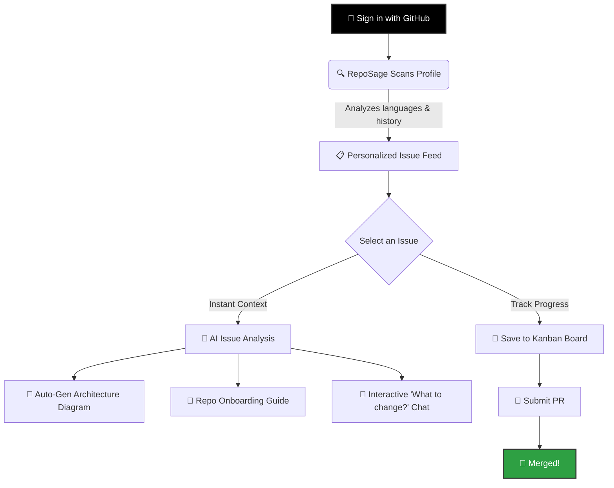

<p align="center">
  
</p>

<p align="center">
  <strong>Your first open-source contribution, guided end-to-end.</strong><br>
  Find beginner-friendly issues, understand complex codebases with AI, and ship your first PR.
</p>

<p align="center">
  <a href="#-for-beginners">For Beginners</a> •
  <a href="#-for-advanced-users--maintainers">For Maintainers</a> •
  <a href="#-quick-start">Quick Start</a> •
  <a href="#-architecture">Architecture</a>
</p>

<p align="center">
  
  
  
  
</p>

---

<!-- 🚨 HEY! Replace this image link with a high-quality GIF or Screenshot of your dashboard! Famous repos ALWAYS have a demo image here. -->
<p align="center">
  
</p>

---

## 📖 What is RepoSage?

The gap between wanting to contribute to open-source and actually merging your first pull request is massive. RepoSage bridges that gap. It is an intelligent platform that acts as your personal open-source mentor, demystifying codebases and guiding you every step of the way.

### 🌱 For Beginners
- **No more searching:** We scan your GitHub profile and feed you `good-first-issues` tailored perfectly to your tech stack.
- **Understand any codebase:** Click an issue, and our AI instantly generates an architecture diagram and an onboarding guide for that specific repository.
- **Ask questions without fear:** Use the AI chat to ask *"Which file do I need to edit to fix this?"* before you ever write a line of code.
- **Interactive Learning:** Learn Git, PR etiquette, and codebase navigation through our built-in interactive modules.

### 🚀 For Advanced Users & Maintainers
- **Grow your community:** RepoSage lowers the barrier to entry for your repository, bringing you a steady stream of capable, well-guided contributors.
- **Extensible AI:** Built on a modular LLM architecture (OpenRouter/Groq), allowing you to plug in deep-context models to analyze massive codebases seamlessly.
- **Modern Edge Architecture:** Built with Next.js 16 App Router, edge middleware, and optimized caching for a blazing-fast, deploy-anywhere user experience.

---

## ✨ Key Features

- 🎯 **Smart Issue Matching:** Algorithmic curation based on your GitHub history and languages.
- 📐 **Automated Architecture Diagrams:** Real-time Mermaid diagram generation for external repositories.
- 🤖 **Context-Aware AI Chat:** DeepSeek/Qwen models that read the repo and answer implementation questions.
- 🛤️ **Kanban Progress Tracking:** Track your issues from *Saved* → *Working* → *PR Submitted* → *Merged*.
- 🎓 **Educational Hub:** 6 structured guides (50+ modules) on the philosophy and mechanics of open source.

---

## 🧠 How It Works

We designed RepoSage to be incredibly simple to use. Here is the exact flow:



---

## ⚡ Quick Start

Get your local environment up and running in under 2 minutes.

### 1. Clone & Install
```bash
git clone https://github.com/yourusername/reposage.git
cd reposage
npm install
```

### 2. Configure Environment
```bash
cp .env.local.example .env.local
```
Fill in the required GitHub OAuth keys in `.env.local`. 

<details>
<summary><b>Need help setting up GitHub OAuth? Click here</b></summary>
<br>

1. Go to [GitHub Settings > Developer Settings > OAuth Apps](https://github.com/settings/developers)
2. Click **New OAuth App**
3. Set **Homepage URL** to `http://localhost:3000`
4. Set **Authorization callback URL** to `http://localhost:3000/api/auth/callback/github`
5. Copy the Client ID and Client Secret into your `.env.local` file.
</details>

### 3. Run
```bash
npm run dev
```
Visit `http://localhost:3000` and start contributing!

---

## 🛠️ Built With

RepoSage is built on a modern, edge-ready stack designed for speed and scalability.

- **Framework:** [Next.js 16](https://nextjs.org) (App Router) & React 19
- **Styling:** [Tailwind CSS v4](https://tailwindcss.com) & [shadcn/ui](https://ui.shadcn.com)
- **Language:** [TypeScript](https://www.typescriptlang.org/) (Strict Mode)
- **AI Integration:** OpenRouter & Groq (DeepSeek V3 / Qwen 2.5)
- **Authentication:** [NextAuth v5](https://authjs.dev) (GitHub OAuth)
- **Data & APIs:** Octokit (GitHub REST API) & Upstash Redis

---

## 🗺️ Roadmap

- [x] GitHub OAuth integration
- [x] Intelligent issue matching algorithm
- [x] AI-generated codebase onboarding & chat
- [x] Interactive open-source learning hub
- [ ] Automated PR status tracking via Webhooks
- [ ] Multi-repo favorite collections
- [ ] Weekly customized email digests

---

## 🤝 Contributing

RepoSage is ironically the perfect place to make your first open-source contribution! 
Check out our [Contributing Guide](CONTRIBUTING.md) to get started. 

Please ensure you read our [Code of Conduct](CODE_OF_CONDUCT.md) to keep our community approachable and respectable.

---

## 📄 License
This project is licensed under the MIT License - see the [LICENSE](LICENSE) file for details.

<p align="center">
  Built with ❤️ for the Open Source Community.
</p>
