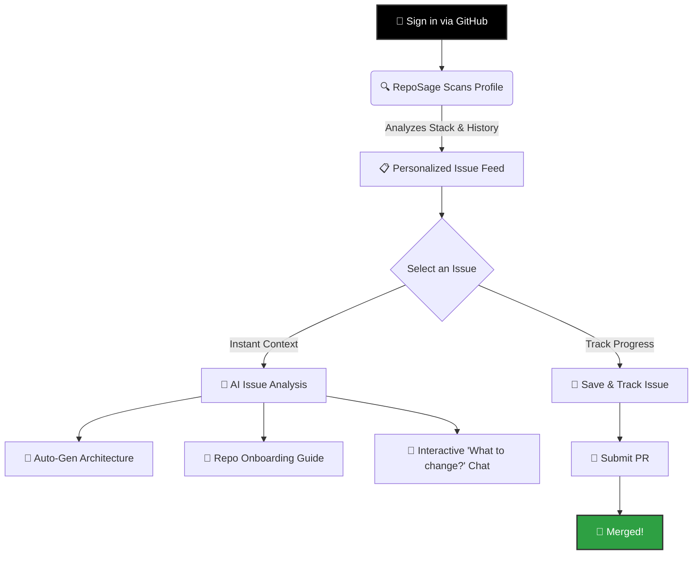
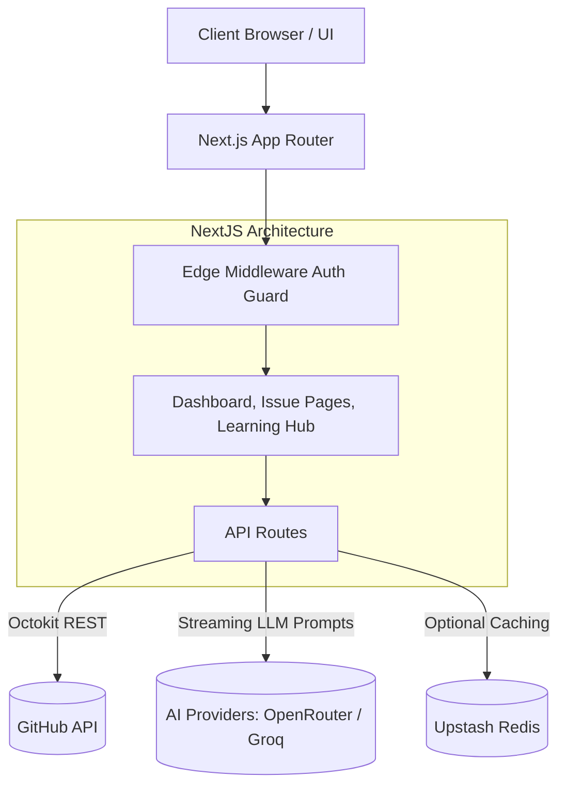

<div align="center">
  
</div>

<div align="center">
  <h3><strong>Your first open source contribution, guided end-to-end.</strong></h3>
  <p>Find beginner-friendly issues matched to your stack, understand the codebase with AI, track your progress, and ship your first PR — all from one dashboard.</p>
</div>

<div align="center">
  
  
  
  
</div>

<br/>

<div align="center">
  <a href="#sparkles-features">Features</a> •
  <a href="#rocket-quick-start">Quick Start</a> •
  <a href="#brain-how-it-works">How It Works</a> •
  <a href="#hammer_and_wrench-architecture--tech-stack">Architecture</a> •
  <a href="#handshake-contributing">Contributing</a>
</div>

---

## 💡 The Problem

Contributing to open-source software (OSS) is intimidating. Beginners face a massive barrier to entry:
1. Finding *genuine* "good first issues" that match their skill set is like finding a needle in a haystack.
2. Understanding large, complex, undocumented codebases is overwhelming.
3. The unspoken etiquette of PRs, communication, and Git workflows can be confusing.

## 🚀 The Solution: RepoSage

**RepoSage** is an intelligent, end-to-end platform designed to bridge the gap between aspiring contributors and open-source maintainers. We combine smart repository scanning, personalized issue matching, and cutting-edge LLM context-awareness to hold your hand through your very first (or fiftieth) pull request.

---

## ✨ Features

<table>
  <tr>
    <td width="50%">
      <h3>🔍 Smart Issue Discovery</h3>
      <p>Stop searching. RepoSage analyzes your GitHub profile, languages, and commit history to automatically feed you <b>good-first-issues</b> perfectly matched to your exact tech stack and skill level.</p>
    </td>
    <td width="50%">
      <h3>🧠 AI-Powered Codebase Analysis</h3>
      <p>Instantly generate <b>architecture diagrams</b> and personalized <b>onboarding guides</b> for any repository. Use the interactive AI chat to ask, <i>"Which files do I need to edit to fix this issue?"</i> and get exact file paths and explanations.</p>
    </td>
  </tr>
  <tr>
    <td width="50%">
      <h3>📚 Interactive Learning Hub</h3>
      <p>Master open-source with six interactive guides (50+ modules) covering Git workflows, how to read codebases, PR etiquette, and communicating with maintainers. Learn at your own pace.</p>
    </td>
    <td width="50%">
      <h3>📊 Progress Tracking Pipeline</h3>
      <p>Don't lose track of your work. Save issues to your personalized Kanban-style pipeline. Track them seamlessly from <b>Saved</b> → <b>Working</b> → <b>PR Submitted</b> → <b>Merged 🎉</b>.</p>
    </td>
  </tr>
</table>

---

## 🧠 How It Works



---

## 🚀 Quick Start

Whether you're a beginner looking to use RepoSage or an advanced developer wanting to run it locally, follow these steps to get your local environment up and running in minutes.

### Prerequisites

Ensure you have the following installed:
- [Node.js](https://nodejs.org/en/) (v20 or higher)
- npm or yarn
- A [GitHub account](https://github.com)

### 1️⃣ Clone the Repository

```bash
git clone https://github.com/yourusername/reposage.git
cd reposage
npm install
```

### 2️⃣ Environment Configuration

Duplicate the `.env.local.example` file:

```bash
cp .env.local.example .env.local
```

Populate the `.env.local` file with your credentials:

| Variable | Requirement | Description |
|----------|-------------|-------------|
| `AUTH_SECRET` | **Required** | Run `openssl rand -base64 32` in your terminal to generate a secure secret. |
| `AUTH_GITHUB_ID` | **Required** | Client ID from your [GitHub OAuth App](https://github.com/settings/developers). |
| `AUTH_GITHUB_SECRET` | **Required** | Client Secret from your GitHub OAuth App. |
| `OPENROUTER_API_KEY` | *Optional* | Your key from [OpenRouter](https://openrouter.ai/keys) to power the AI capabilities. |
| `UPSTASH_REDIS_REST_URL` | *Optional* | URL for server-side caching via [Upstash](https://upstash.com). |
| `UPSTASH_REDIS_REST_TOKEN` | *Optional* | Token for Upstash Redis. |

> **Note:** The AI features are entirely optional. If no API key is provided, the app will gracefully degrade and prompt users to configure their provider in the settings.

<details>
<summary><b>Click here for instructions on setting up GitHub OAuth</b></summary>

1. Go to [GitHub Settings > Developer Settings > OAuth Apps](https://github.com/settings/developers)
2. Click **New OAuth App**
3. Set **Homepage URL** to `http://localhost:3000`
4. Set **Authorization callback URL** to `http://localhost:3000/api/auth/callback/github`
5. Copy the Client ID and Client Secret into your `.env.local` file.
</details>

### 3️⃣ Run the App

Start the development server:

```bash
npm run dev
```

Open [http://localhost:3000](http://localhost:3000) in your browser. Sign in with GitHub, and watch the magic happen! ✨

---

## 🛠️ Architecture & Tech Stack

RepoSage is built on a modern, highly scalable, and type-safe architecture.

### The Stack
- **Framework:** [Next.js 16](https://nextjs.org) (App Router, React 19, Turbopack)
- **Language:** [TypeScript](https://typescriptlang.org) (Strict Mode)
- **Styling:** [Tailwind CSS v4](https://tailwindcss.com) + [shadcn/ui](https://ui.shadcn.com)
- **Authentication:** [NextAuth v5](https://authjs.dev) (GitHub OAuth)
- **GitHub Integration:** [Octokit](https://octokit.github.io/rest.js/)
- **AI / LLMs:** OpenRouter / Groq (DeepSeek V3, Qwen 2.5 Coder, etc.)
- **Visuals:** [Framer Motion](https://motion.dev) & [Mermaid](https://mermaid.js.org)

### System Architecture



---

## 🗺️ Roadmap

We're constantly iterating. Here is a glimpse into the future of RepoSage:

- [x] **P0:** GitHub Auth with NextAuth v5
- [x] **P0:** Intelligent Dashboard with issue feed & filters
- [x] **P0:** LLM-powered onboarding guides and architecture generation
- [x] **P0:** 6-Part Interactive Learning Hub
- [x] **P0:** Issue save, track, and progression system
- [ ] **P1:** Server-side progress synchronization (Redis)
- [ ] **P1:** Favorites and collections page
- [ ] **P1:** Automated PR status tracking via GitHub webhooks
- [ ] **P2:** Weekly personalized email digests
- [ ] **P2:** Global Search with autocomplete
- [ ] **P2:** Dark mode refinement

---

## 🤝 Contributing

**We want you!** Whether you're a complete beginner or a seasoned open-source veteran, RepoSage is the perfect place to contribute. 

1. Read our [Contributing Guidelines](CONTRIBUTING.md) to get started.
2. Check out our [Code of Conduct](CODE_OF_CONDUCT.md) to ensure a welcoming community for everyone.
3. Browse our `good first issues` and jump right in!

---

## 📝 License

This project is licensed under the **MIT License** - see the [LICENSE](LICENSE) file for details.

<div align="center">
  <sub>Built with ❤️ for the Open Source Community.</sub>
</div>
