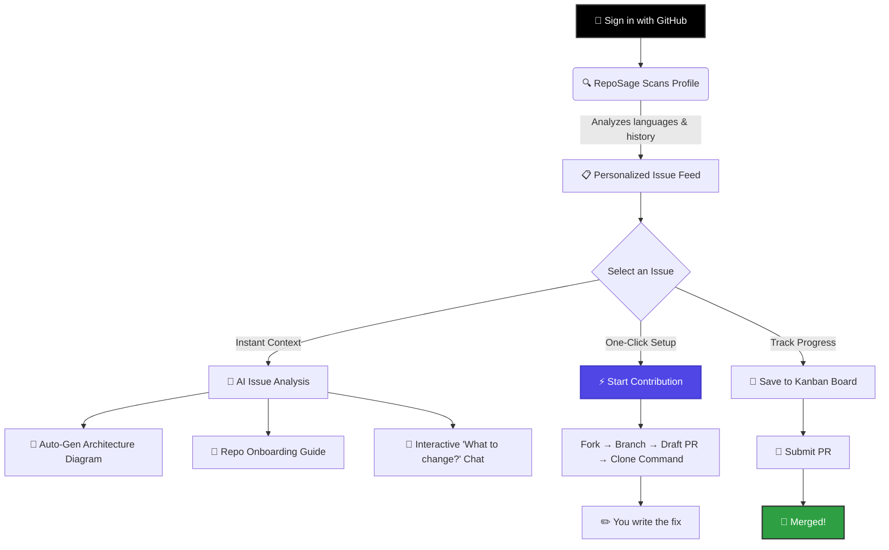

<p align="center">
  
</p>

<p align="center">
  <strong>From "I want to contribute" to a real draft PR — in one click.</strong><br>
  Find beginner-friendly issues, understand any codebase with AI, and ship your first PR.
</p>

<p align="center">
  <a href="#-the-start-contribution-button">Start Contributing</a> •
  <a href="#-for-beginners">For Beginners</a> •
  <a href="#-for-advanced-users--maintainers">For Maintainers</a> •
  <a href="#-quick-start">Quick Start</a>
</p>

<p align="center">
  
  
  
  
</p>

---


## 📖 What is RepoSage?
The gap between wanting to contribute to open source and actually merging your first PR is enormous. You find an interesting issue. Then what?

- Which file do I even edit?
- How do I fork this correctly?
- What should I name my branch?
- What do I write in the PR description?

Most people quietly close the tab. **RepoSage bridges that gap.**

It's an intelligent open-source mentorship platform that handles everything between finding an issue and writing the actual code — the part that stops 90% of beginners.

### 🌱 For Beginners
- **No more searching:** We scan your GitHub profile and feed you `good-first-issues` tailored perfectly to your tech stack.
- **Understand any codebase:** Click an issue, and our AI instantly generates an architecture diagram and an onboarding guide for that specific repository.
- **Ask questions without fear:** Use the AI chat to ask *"Which file do I need to edit to fix this?"* before you ever write a line of code.
- **Skip the setup chaos:** Click "Start Contribution" and go from issue page to cloned repo in under 60 seconds.
- **Interactive Learning:** Learn Git, PR etiquette, and codebase navigation through our built-in educational hub.

### 🚀 For Advanced Users & Maintainers
- **Grow your community:** RepoSage lowers the barrier to entry for your repository, bringing you a steady stream of capable, well-guided contributors.
- **Extensible AI:** Built on a modular LLM architecture (OpenRouter/Groq), allowing you to plug in deep-context models to analyze massive codebases seamlessly.
- **Modern Edge Architecture:** Built with Next.js 16 App Router, edge middleware, and optimized caching for a blazing-fast, deploy-anywhere user experience.

---

## ⚡ The "Start Contribution" Button

The centerpiece feature. Click it on any issue and RepoSage:

1. **Forks** the repo to your GitHub account (if you haven't already)
2. **Creates** a descriptive branch named from the issue context
3. **Opens** a draft PR with a pre-filled description linked to the issue
4. **Gives** you a single command to clone and checkout — ready to paste into your terminal

```bash
# What you see after clicking "Start Contribution":
git clone git@github.com:yourusername/repo.git && cd repo && git checkout fix/issue-123-button-alignment
```

Setup that used to take 20 confused minutes now takes **under 60 seconds.**

---

## ✨ Key Features

| | Feature | What it does |
|---|---|---|
| 🎯 | **Smart Issue Matching** | Scans your GitHub profile and surfaces good-first-issues matched exactly to your tech stack and languages. No more endless scrolling. |
| 📐 | **Automated Architecture Diagrams** | Click any issue and get a real-time Mermaid architecture diagram for that repository. Understand the codebase before you touch a file. |
| 🤖 | **Context-Aware AI Chat** | Ask "which file do I edit to fix this?" and get a real answer. DeepSeek/Qwen models read the repo and respond with actual context. |
| ⚡ | **Start Contribution Button** | One click. Fork → branch → draft PR → clone command. The entire setup flow in under 60 seconds. |
| 🛤️ | **Kanban Progress Tracker** | Track every issue across four stages: Saved → Working → PR Submitted → Merged. |
| 🎓 | **Educational Hub** | 6 structured guides covering 50+ modules on Git, PR etiquette, and the philosophy of open source. |

---

## 🧠 How It Works



---

## ⚡ Quick Start

Get your local environment up and running in under 2 minutes.

### 1. Clone & Install
```bash
git clone https://github.com/yourusername/reposage.git
cd reposage
npm install
```

### 2. Configure Environment
```bash
cp .env.local.example .env.local
```

Fill in your keys in `.env.local`:

```
# GitHub OAuth (required)
GITHUB_CLIENT_ID=
GITHUB_CLIENT_SECRET=
NEXTAUTH_SECRET=
NEXTAUTH_URL=http://localhost:3000

# AI (required for chat + diagrams)
OPENROUTER_API_KEY=

# Caching (optional but recommended)
UPSTASH_REDIS_REST_URL=
UPSTASH_REDIS_REST_TOKEN=
```

<details>
<summary><b>Need help setting up GitHub OAuth? Click here</b></summary>
<br>

1. Go to [GitHub Settings > Developer Settings > OAuth Apps](https://github.com/settings/developers)
2. Click **New OAuth App**
3. Set **Homepage URL** to `http://localhost:3000`
4. Set **Authorization callback URL** to `http://localhost:3000/api/auth/callback/github`
5. Copy the Client ID and Client Secret into your `.env.local` file.
</details>

### 3. Run
```bash
npm run dev
```

Visit `http://localhost:3000` — you're ready to contribute.

---

## 🛠️ Tech Stack

| Layer | Technology |
|---|---|
| **Framework** | Next.js 16 (App Router) + React 19 |
| **Language** | TypeScript (Strict Mode) |
| **Styling** | Tailwind CSS v4 + shadcn/ui |
| **AI** | OpenRouter + Groq (DeepSeek V3 / Qwen 2.5) |
| **Auth** | NextAuth v5 — GitHub OAuth |
| **GitHub API** | Octokit (REST) |
| **Caching** | Upstash Redis |
| **Deployment** | Vercel (Edge Runtime) |

---

## 🗺️ Roadmap

- [x] GitHub OAuth integration
- [x] Intelligent issue matching algorithm
- [x] AI-generated codebase onboarding & chat
- [x] Interactive open-source learning hub
- [x] One-click Start Contribution → draft PR
- [ ] Automated PR status tracking via Webhooks
- [ ] Multi-repo favorite collections
- [ ] Weekly customized email digests

---

## 🤝 Contributing

RepoSage is built for contributors — it's only right that contributing to RepoSage itself is painless.

1. Find an open issue that interests you
2. Click **Start Contribution** (yes, we use our own tool)
3. Write your fix
4. Push to your branch — your draft PR is already waiting

First time contributing to open source? RepoSage will walk you through it. That's the whole point.

Check out our [Contributing Guide](CONTRIBUTING.md) and please read our [Code of Conduct](CODE_OF_CONDUCT.md) to keep our community approachable and respectable.

---

## 📄 License

This project is licensed under the MIT License — see the [LICENSE](LICENSE) file for details.

<p align="center">
  Built with obsession for the people who want to contribute but don't know where to start.
</p>

<p align="center">
  <a href="https://the-repo-sage.vercel.app">Try RepoSage →</a>
</p>
